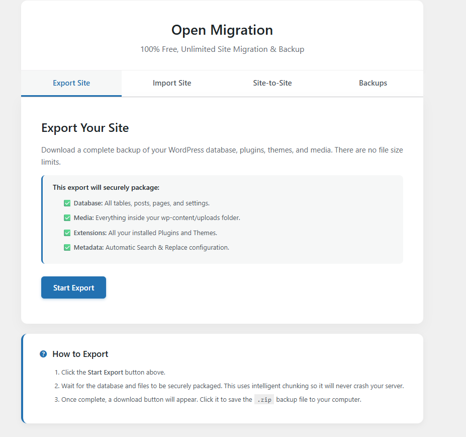
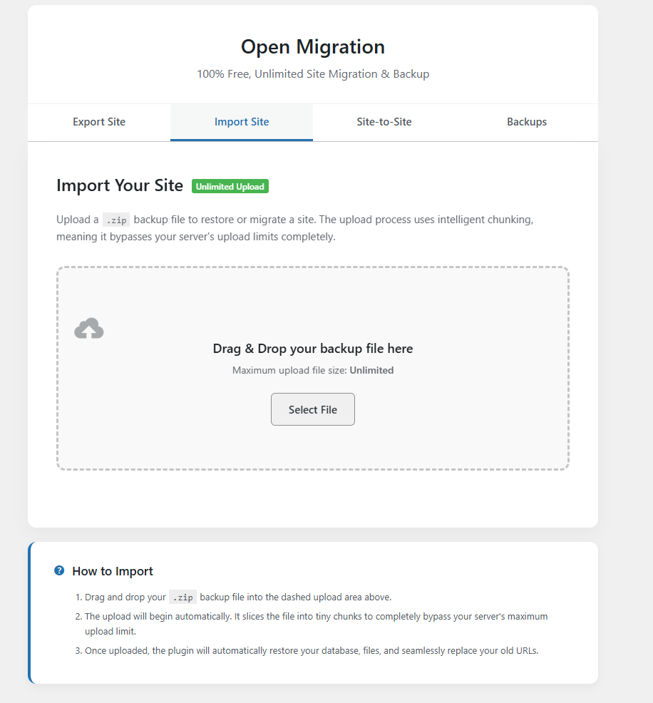
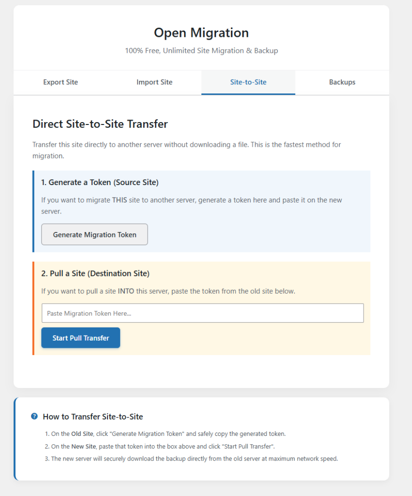
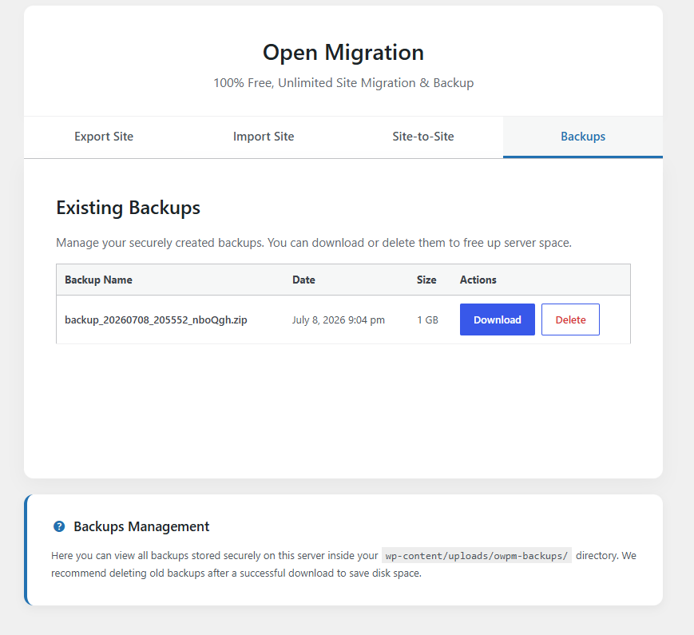

# Open WP Migration — Unlimited Site Transfer & Backup

### The only WordPress migration and backup plugin you'll never have to pay for.

**Migrate massive 5GB+ websites, perform complete backups, and automatically search & replace URLs — all without paying a single cent. Ever.**

Your site data never leaves your server. No cloud dependencies. No hidden limits. Open-source and offline-first.

[Download Now](https://github.com/IamRamgarhia/open-migration/archive/refs/heads/master.zip) &nbsp;|&nbsp; [Screenshots](#screenshots) &nbsp;|&nbsp; [5-Minute Quick Start](#your-first-backup-in-5-minutes) &nbsp;|&nbsp; [Report Bug](https://github.com/IamRamgarhia/open-migration/issues) &nbsp;|&nbsp; [Request Feature](https://github.com/IamRamgarhia/open-migration/issues)

---

## 📸 Screenshots

<table align="center">
  <tr>
    <td align="center">
      <b>Seamless Site Export</b>  
      
       <i>One-click exports with intelligent chunking.</i>
    </td>
    <td align="center">
      <b>Limitless Site Import</b>  
      
       <i>Bypass PHP upload limits completely.</i>
    </td>
  </tr>
  <tr>
    <td align="center">
       <b>Direct Site-to-Site Transfer</b>  
      
       <i>Pull your site directly without a ZIP file.</i>
    </td>
    <td align="center">
       <b>Built-in Backup Management</b>  
      
       <i>Manage, download, or delete past backups.</i>
    </td>
  </tr>
</table>

---

## 📑 Table of Contents

- [Why Choose Open Migration?](#why-choose-open-migration)
- [Your First Backup in 5 Minutes](#your-first-backup-in-5-minutes) — *start here if you're new*
- [Key Features](#key-features)
  - [Migration & Export](#outbox_tray-migration--export)
  - [Import & Restoration](#inbox_tray-import--restoration)
  - [Backup Management](#briefcase-backup-management)
- [Comparison: Open Migration vs Paid Alternatives](#-comparison-open-migration-vs-paid-alternatives)
- [Quick Start / Installation](#quick-start--installation)
- [Documentation & FAQ](#books-documentation--faq)
- [Who Is This For?](#who-is-this-for)
- [Why Is This Free?](#why-is-this-free)
- [Data Privacy & Security](#data-privacy--security)
- [Contributing](#contributing)
- [Contact & Support](#contact--support)

---

## Your First Backup in 5 Minutes

A step-by-step guide for creating your very first full-site backup. Targeted at users who want to safely export their site before making changes.

### Before you start
You need: A WordPress website (PHP 7.4 or higher). **No coding knowledge required.**

### Step 1 — Install (1 minute)

1. Download the project as a ZIP from [this link](https://github.com/IamRamgarhia/open-migration/archive/refs/heads/master.zip) or the Releases page.
2. Go to your WordPress Admin Dashboard → **Plugins** → **Add New** → **Upload Plugin**.
3. Choose the downloaded `open-migration.zip` file.
4. Click **Install Now** and then **Activate**.

### Step 2 — Create your export (2 minutes)

1. Click on **Open Migration** in your WordPress sidebar.
2. You will land on the **Export** tab.
3. Review the checklist of what will be exported (Database, Plugins, Themes, Uploads).
4. Click the large **Export Site** button.
5. Watch the real-time progress bar as it safely packages your entire site into a `.zip` archive.

### Step 3 — Download or Manage (1 minute)

Once the export finishes, you have two options:
- **Download immediately:** Click the download prompt to save the ZIP to your computer.
- **Manage Backups:** Switch to the **Backups** tab to see all your past exports. From here, you can download them or delete them to free up server space.

That's it! You have successfully backed up your WordPress site. 

📖 **Full walkthrough** — see the [Documentation & FAQ](#books-documentation--faq) below for importing instructions.

---

## Why Choose Open Migration?

Most WordPress migration plugins — All-in-One WP Migration, Duplicator, UpdraftPlus — charge you for premium extensions the moment your website gets larger than 512MB, or if you want to use Multisite. **Open Migration is the open-source alternative that changes everything.**

- **Completely free** — no premium tier, no paid extensions, no hidden charges.
- **ZERO file size limits** — whether your site is 50MB or 50GB, we migrate it for free.
- **Your data stays on YOUR server** — backups are stored securely in `wp-content/uploads/owpm-backups`. No cloud tracking.
- **Beautiful, native UI** — built with modern React-like architecture that feels blazing fast.
- **Install once, use forever** — GPLv2 licensed, open-source, community-driven.

> **If you're paying to move your own data, you can stop now.**

### 📊 Comparison: Open Migration vs Paid Alternatives

| Feature | **Open Migration** | All-in-One WP Migration | Duplicator | UpdraftPlus |
|---|---|---|---|---|
| **Price** | ✅ **Free forever** | Freemium | Freemium | Freemium |
| **Import Size Limit** | ✅ **Unlimited** | 512MB limit | Limited | Limited |
| **Database Search & Replace** | ✅ Automatic | ✅ | ✅ | ⚠ Paid feature |
| **Direct Site-to-Site Transfer** | 🚀 Coming Soon | ⚠ Paid Extension | ⚠ Paid Version | ⚠ Paid Version |
| **Cloud Storage (Drive/Dropbox)** | 🚀 Coming Soon | ⚠ Paid Extensions | ⚠ Paid Version | ⚠ Paid Version |
| **Multisite Support** | 🚀 Coming Soon | ⚠ Paid Extension | ⚠ Paid Version | ⚠ Paid Version |
| **Real-time Zipping Progress** | ✅ Yes | ✅ | ✅ | ⚠ Basic |
| **Modern, Fast UI** | ✅ Yes | ⚠ Dated UI | ⚠ Dated UI | ⚠ Dated UI |
| **Your data on YOUR server** | ✅ Yes | ✅ Yes | ✅ Yes | ✅ Yes |
| **Open-source** | ✅ Yes | ❌ Proprietary | ❌ Proprietary | ❌ Proprietary |

---

## Key Features

### :outbox_tray: Migration & Export
- **One-Click Export:** Package your Database, Themes, Plugins, Uploads, and Metadata into a single standard `.zip` file.
- **Real-Time Tracking:** Watch exactly which file is being zipped with our real-time UI tracking so you never wonder if the process stalled.
- **Selective Exporting (Coming soon):** Choose to exclude media files, spam comments, or specific plugins.

### :inbox_tray: Import & Restoration
- **Bypass PHP Upload Limits:** Built-in chunking allows you to upload massive files even if your web host restricts `upload_max_filesize`.
- **Automatic Search & Replace:** Intelligently finds your old domain and replaces it with the new domain in the database, ensuring serialized data isn't broken.
- **Raw SQL Import:** Restores your database efficiently using robust SQL execution, completely bypassing standard WP parsing bottlenecks.

### :briefcase: Backup Management
- **Centralized Dashboard:** View all your past `.zip` exports directly within WordPress.
- **One-Click Download/Delete:** Easily manage server space by deleting old backups or downloading them to your local hard drive.

---

## 📚 Documentation & FAQ

**Q: Is it really 100% free? Are there any hidden fees?**  
**A:** Yes. Open Migration is 100% free and open-source forever. There are no "Pro" versions, no paid extensions, and no hidden subscriptions.

**Q: What is the maximum file size I can import?**  
**A:** Unlimited. Unlike All-in-One WP Migration which caps free imports at 512MB, Open Migration utilizes chunked uploading to bypass server limits, allowing you to migrate 5GB+ sites easily.

**Q: How does this compare to Duplicator or UpdraftPlus?**  
**A:** Duplicator requires you to manage `installer.php` files and manually create databases. UpdraftPlus charges for basic features like database search and replace. Open Migration is a single-click solution inside WordPress that handles the database replacement automatically for free.

**Q: Where are my backups stored?**  
**A:** Backups are securely generated in your `wp-content/uploads/owpm-backups` directory. An `.htaccess` and `index.php` file are automatically generated to prevent unauthorized external access to your ZIP files.

**Q: Does this work on WordPress Multisite?**  
**A:** Not yet, but Multisite support is our top priority for the next major release—and it will be 100% free when it launches!

---

## Who Is This For?

- **Freelancers & Agencies:** Stop paying $69/year for basic migration extensions every time you move a client site from staging to production.
- **DIY Website Owners:** Safely backup your site before updating plugins or changing themes without needing a degree in server administration.
- **Developers:** An open-source tool you can fork, modify, and contribute to.

## Why Is This Free?

Because your data belongs to you. The WordPress ecosystem was built on the back of free, open-source software (GPL). We believe that moving your own website from one host to another is a fundamental right, not a premium feature to be locked behind a paywall.

## Data Privacy & Security

**Privacy:** Open Migration is strictly offline-first. Your data is compressed locally on your server. We do not track you, we do not require you to create an account, and we absolutely do not send your website data to our servers.

**Security:** We automatically inject security files (`.htaccess` and `index.html`) into the backup directory to prevent directory browsing and direct file downloads by unauthorized users.

---

## Contributing

We strongly believe in community-driven development! If you want to help make Open Migration even better:
1. Fork the repository.
2. Create a new branch (`git checkout -b feature/AmazingFeature`).
3. Commit your changes (`git commit -m 'Add some AmazingFeature'`).
4. Push to the branch (`git push origin feature/AmazingFeature`).
5. Open a Pull Request.

## Contact & Support

If you found a bug or have a feature request, please [open an issue on GitHub](https://github.com/IamRamgarhia/open-migration/issues). 

*Made with ❤️ for the WordPress Community.*
